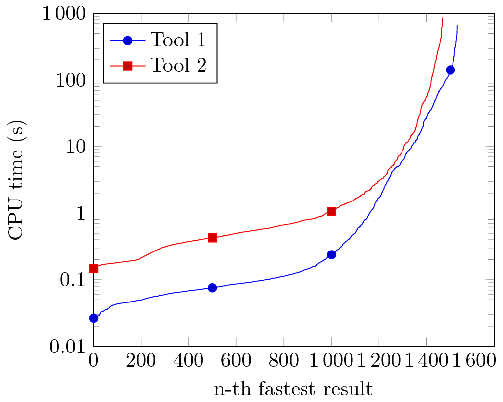
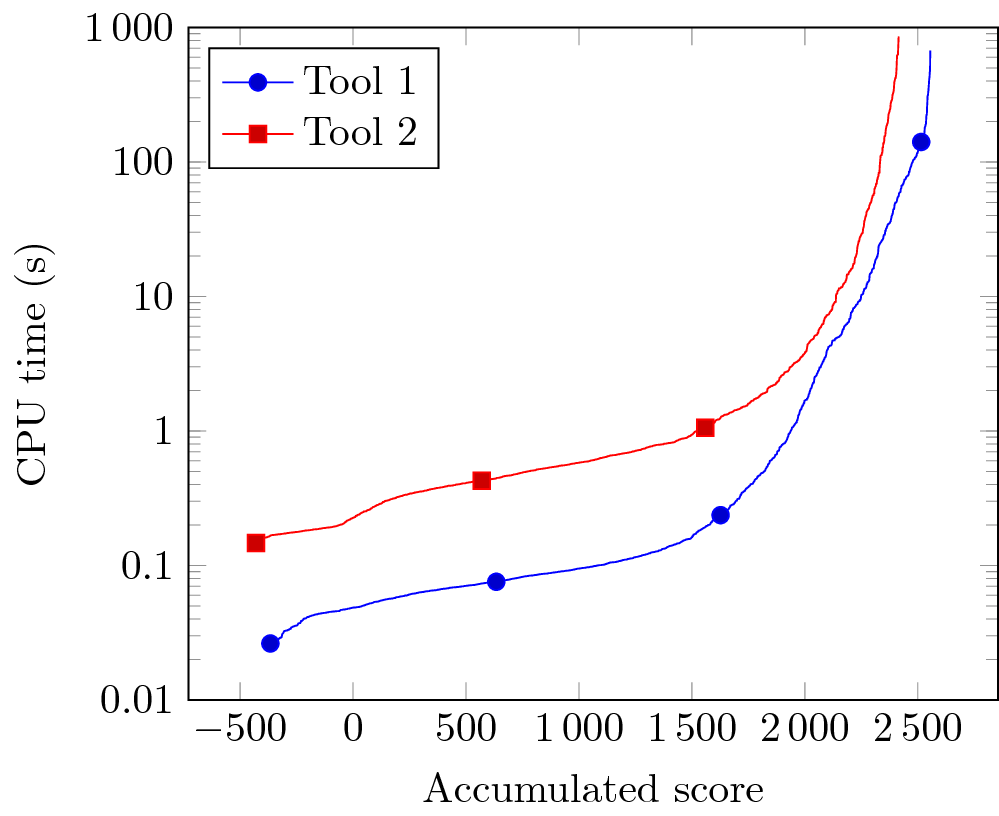
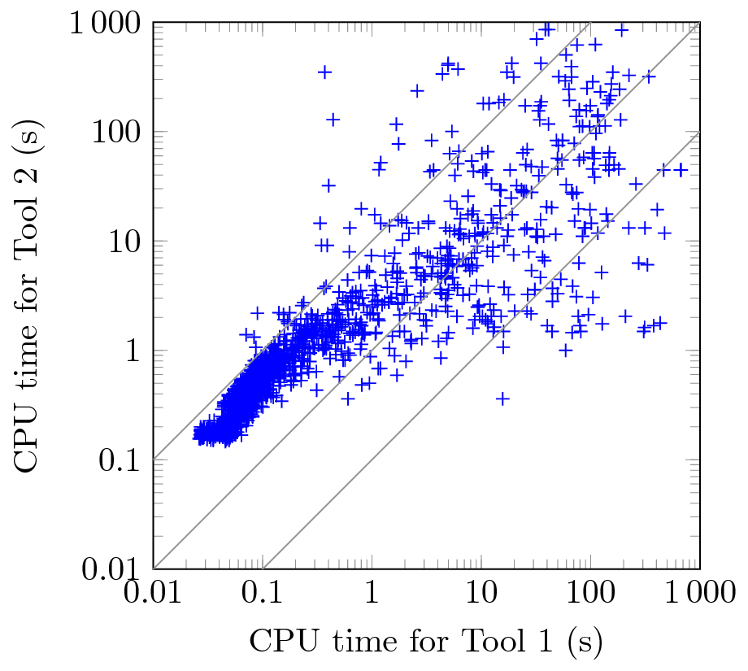
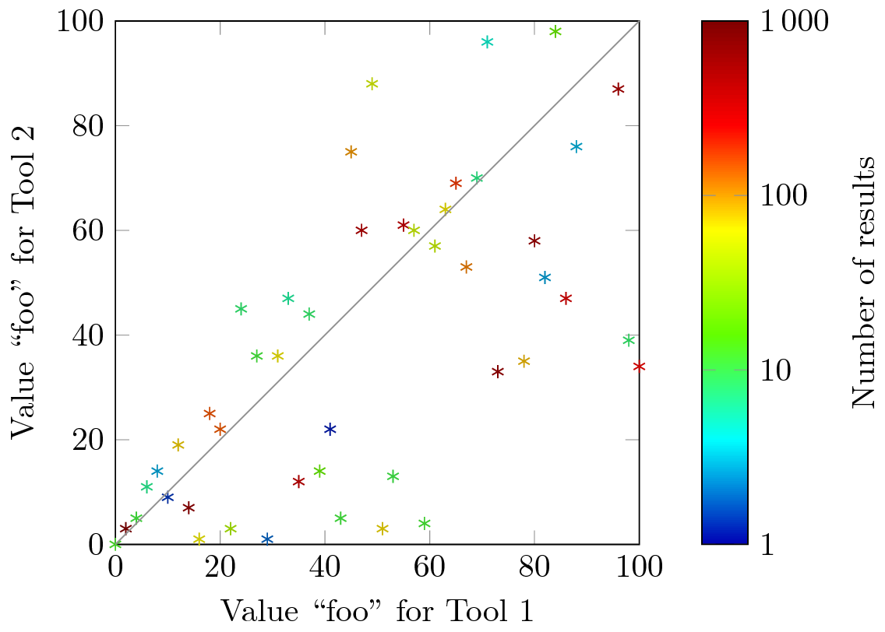

<!--
This file is part of BenchExec, a framework for reliable benchmarking:
https://github.com/sosy-lab/benchexec

SPDX-FileCopyrightText: 2007-2020 Dirk Beyer <https://www.sosy-lab.org>

SPDX-License-Identifier: Apache-2.0
-->

# BenchExec Contrib
## Generating Plots from BenchExec Data
This directory contains helper files for producing plots
from data produced with BenchExec.

### Plot Types
There are helper files for two different types of plots here:
quantile plots (also known as cactus plots) and scatter plots.
Quantile plots allow an arbitrary amount of data columns to be compared,
and sort each of the columns individually by its value.
Scatter plots allow only two columns to be compared,
but show the relation between the two values for each individual data point.
An alternative to regular quantile plots are score-based quantile plots,
where the x-axis does not show the number of results,
but the accumulated score achieved with these results.
Such plots are for example used by the
[International Competition on Software Verification](http://sv-comp.sosy-lab.org/2015/results/).

Here are four example plots, generated with LaTeX and [PGFPlots](http://pgfplots.sourceforge.net/):

Quantile plot | Score-based quantile plot
--- | ---
 | 

Scatter plot | Scatter plot with color as 3rd axis
--- | ---
 | 

### Preparation
Most tools for producing plots can use CSV files as input,
and BenchExec can generate such files for benchmark results
(using a tab as column separator).

For quantile plots, the script [quantile-generator.py](quantile-generator.py)
can generate appropriate CSV files directly from the `benchexec` result XML files.
A separate CSV file needs to be generated for each graph you want to have in your plot.
For score-based quantile plots,
simply specify the option `--score-based` to `quantile-generator.py`.

For scatter plots, an XML file with a table definition needs to be written
that contains the two data columns that should be shown in the plot,
as in [scatter.xml](scatter.xml).
Then `table-generator` can be used to create a CSV file for this table.

In general, when plotting resource usage it is recommended to show only
data points for correct results, and omit data points for wrong results and crashes.
Otherwise, a wrong answer or crash after for example 10s would look "better"
in the plot than a correct answer after 100s.
This can be done by generating appropriate CSV files with the parameter `--correct-only`
for `table-generator` and `quantile-generator.py`.
Note that for scatter plots this means that only data points are shown for tasks
for which both runs gave a correct answer.

The script [generate-plots.sh](generate-plots.sh) shows examples of the necessary commands.
The example results in this directory can be used to test the scripts and plot definitions
(simply run the generate script),
with the exception of the `scatter-counted` plots, for which no example data is present.

### Plots with Gnuplot
The files `*.gp` contain plot definitions for [Gnuplot](http://www.gnuplot.info).
The file [quantile.gp](quantile.gp) defines a quantile plot,
[quantile-score.gp](quantile-score.gp) defines a score-based quantile plot,
and [quantile-split.gp](quantile-split.gp) defines a quantile plot
with a linear scale for the y-range [0,1] and a logarithmic scale beyond.
The file [scatter.gp](scatter.gp) defines a scatter plot,
and [scatter-counted.gp](scatter-counted.gp) defines a scatter plot
where the color of each data point indicates the number of its occurrences
(best for discrete data).

### Plots with LaTeX (TikZ/PGFPlots)
The files `*.tex` contain plot definitions for LaTeX
with the help of the package [PGFPlots](http://pgfplots.sourceforge.net/)
([manual](http://pgfplots.sourceforge.net/pgfplots.pdf)),
which is available in most LaTeX distributions by default.
No other programs or external compilation steps are necessary.
The file [quantile.tex](quantile.tex) defines a quantile plot and
[quantile-score.tex](quantile-score.tex) defines a score-based quantile plot.
The file [scatter.tex](scatter.tex) defines a scatter plot,
and [scatter-counted.tex](scatter-counted.tex) defines a scatter plot
where the color of each data point indicates the number of its occurrences
(best for discrete data).

These examples use the package [standalone](https://www.ctan.org/pkg/standalone)
to be compilable with a minimal document.
You can copy the `tikzpicture` environment into your own document,
or load the `standalone` package and use `\input` to include a file with a figure
(the preamble in the included file will be ignored).
In any case, make sure that the packages `pgfplots` and `siunitx` are loaded.
Our suggested options for these packages are:

```latex
\usepackage[
    group-digits=integer, group-minimum-digits=4, % group digits by thousands
    list-final-separator={, and }, add-integer-zero=false,
    free-standing-units, unit-optional-argument, % easier input of numbers with units
    binary-units,
    detect-weight=true, detect-inline-weight=math, % for bold cells
    ]{siunitx}[=v2]
\usepackage{pgfplots}
\pgfplotsset{
    compat=1.9,
    log ticks with fixed point, % no scientific notation in plots
    table/col sep=tab, % only tabs are column separators
    unbounded coords=jump, % better have skips in a plot than appear to be interpolating
    filter discard warning=false, % Don't complain about empty cells
    }
\SendSettingsToPgf % use siunitx formatting settings in PGF, too
```
